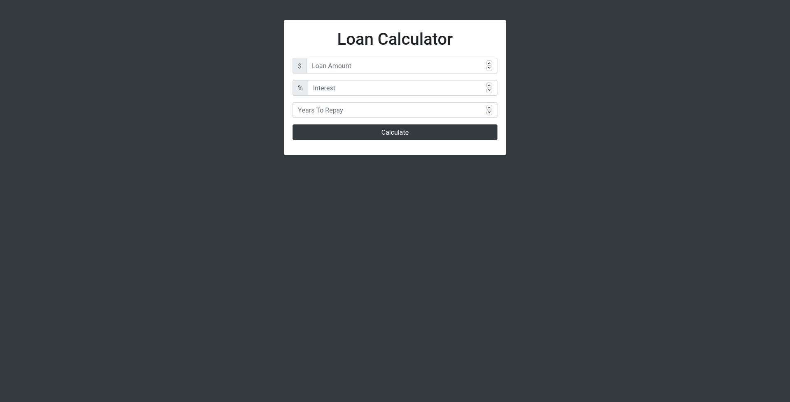

# Loan App
This app is used to calculate loan. You will enter `Loan Amount`, `Interest` and `Years To Repay` then the loan calculator will calculate `Monthly Payment`, `Total Payment` and `Total Interest` for you. If `Monthly Payment` is not finite then it will display the error on the top of the card.

# How To Run
1. `git clone https://github.com/lamkimphu258/loan-app`
2. `cd loan-ap`
3. `chmod +x run.sh`
4. `./run.sh`

# Online Website
https://lamkimphu258.github.io/loan-app/